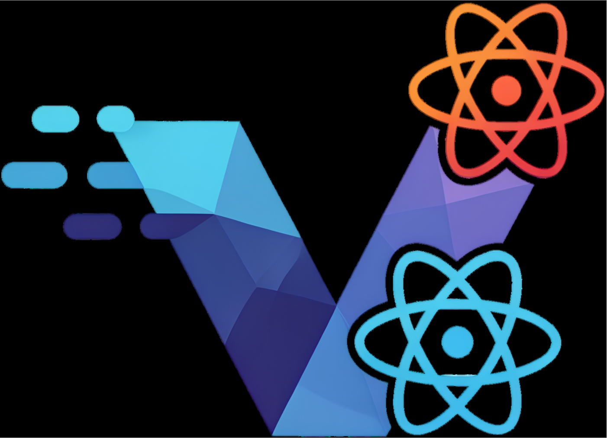

# VERB 

A modern monorepo starter built with Vite, Elysia, React and Bun.

> **Inspiration**
>
> The structure and philosophy of this monorepo are heavily inspired by the excellent [`bhvr` starter template](https://github.com/stevedylandev/bhvr) created by [Steve Simkins](https://github.com/stevedylandev). Its clean and typesafe full-stack setup provided the foundational idea for this project.

